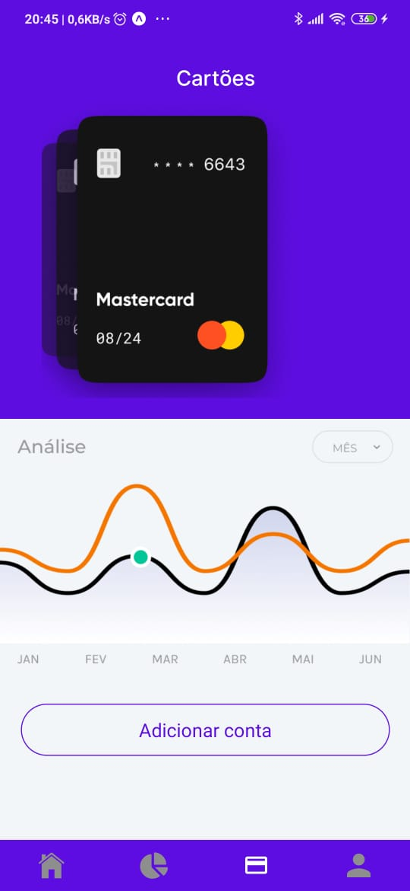
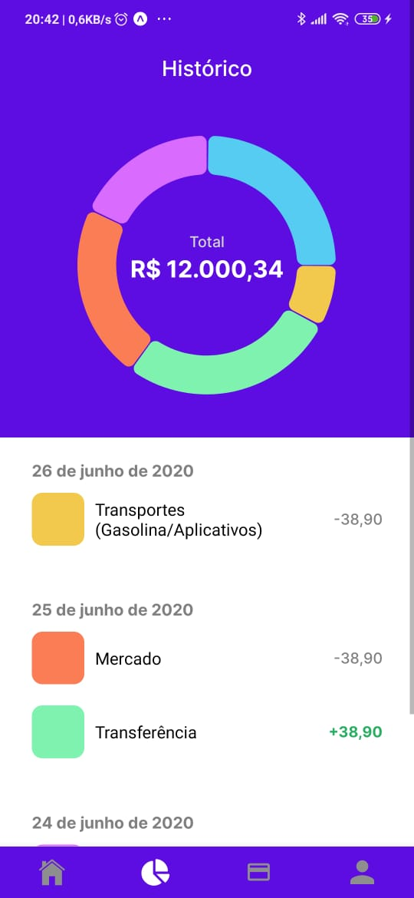

   

# Bússola Financeira

 

> There ain't such thing as free lunch!

Se você é um **jurado** ou quer baixar a solução, nós disponibilizamos uma arquivo **.apk** que pode ser baixado [aqui](https://drive.google.com/drive/folders/17fbCnVLj_lAa8aUmqjZJllz1QEtCucrT?usp=sharing) ou escaneie o QRCODE:

---

# :pushpin: Summary

- [Descrição](#pencil-description)
- [Features](#rocket-features)
- [Instalação](#construction_worker-installation)
- [Iniciando](#runner-getting-started)
- [Issues](#bug-issues)
- [License](#closed_book-license)

# :pencil: Descrição

A **Bússola Financeira** 🧭 é o aplicativo que vai dar um **upgrade** :sparkles: na forma de você administrar o **seu dinheiro**. Ela é uma plataforma que visa traçar metas de planejamento e economia baseadas no seu perfil e histórico financeiro. Através de _Machine Learning_ e _Inteligência Artificial_ nós asseguramos as melhores decisões de investimento e até mesmo corte de gastos para você conseguir alcançar o seu objetivo :dart:.

# :star: Features

- Sugestões de economia personalizadas baseadas no seu perfil financeiro
- Investimento automático do arredondamento de pagamentos que terminem em centavos
- Análise e do seu histórico financeiro e projeção futura de ganhos/economias.
- Interação via Assistentes Virtuais (Google Assistant/Alexa)
- Cruzamento de dados de pessoas com o mesmo perfil para estimar investimentos/economias

**Obs: O backend do projeto ainda está em construção.**

# :construction_worker: Instalação

Você precisará instalar o [Node.js](https://nodejs.org/en/download/) e o [Yarn](https://yarnpkg.com/) primeiro.

Após isso, instale a [expo-cli](https://docs.expo.io/workflow/expo-cli) globalmente e é só clonar o projeto com:

`git clone https://github.com/wemboava/hackathon-tecban`;

# :rocket: Iniciando

Para iniciar o **app** em modo de desenvolvimento é só:

`yarn dev`

Obs.: Você precisa ter a [expo-cli](https://docs.expo.io/workflow/expo-cli) instalada globalmente no seu npm.

# :bug: Issues

Se sinta livre para **abrir um novo issue** no [Repositório da Bússola](https://github.com/wemboava/hackathon-tecban). Se você já encontrou uma solução para o seu problema só enviar um **pull request** que se adeque ao [guia de contribuição](https://github.com/wemboava/hackathon-tecban/master/CONTRIBUTING.md).

# :closed_book: License

Released in 2020 for the TecBan Hackathon.
This project is under the [MIT license](https://github.com/https://github.com/wemboava/hackathon-tecban/LICENSE).
